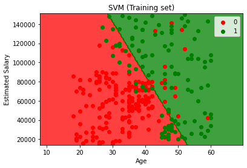
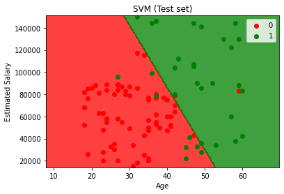
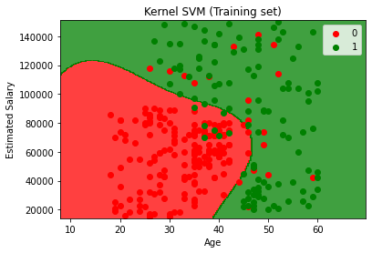
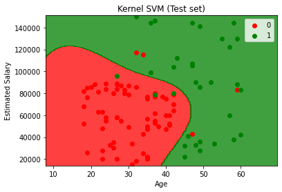

# SVM's Kernel Selection

Using linear kernel SVM (one of the most common AI algorithms) and Radial Basis Function (RBF) kernel SVM, I try to predict whether people would buy SUVs based on their anticipated salary and age. I divided the data into training and test sets and trained both models using the Training set. The feature scaling and inverse transformation approaches were used. I discovered that Kernel RBF handles non-linearity better than linear kernel, with a confusion matrix accuracy of 0.93, whereas linear kernel's confusion matrix accuracy is 0.9. In both models, I present figures that visualize the training and test results.


```bash
$ pip install -r requirement.txt
```




